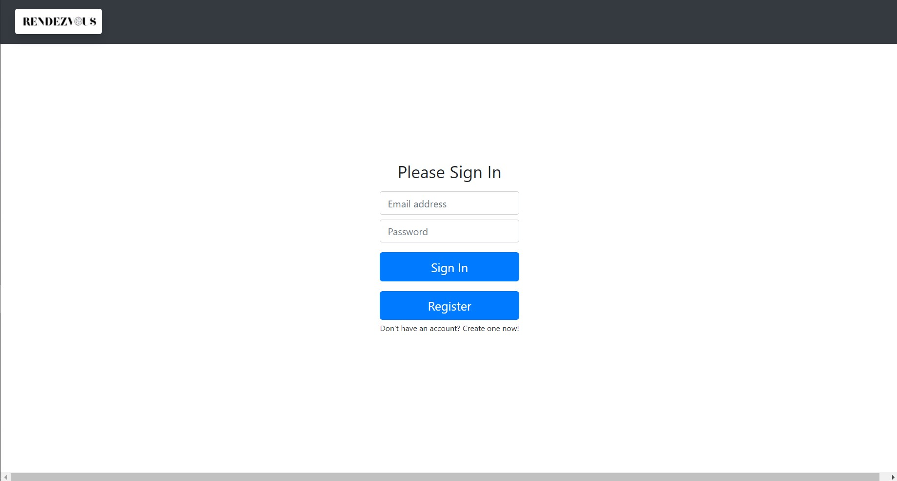
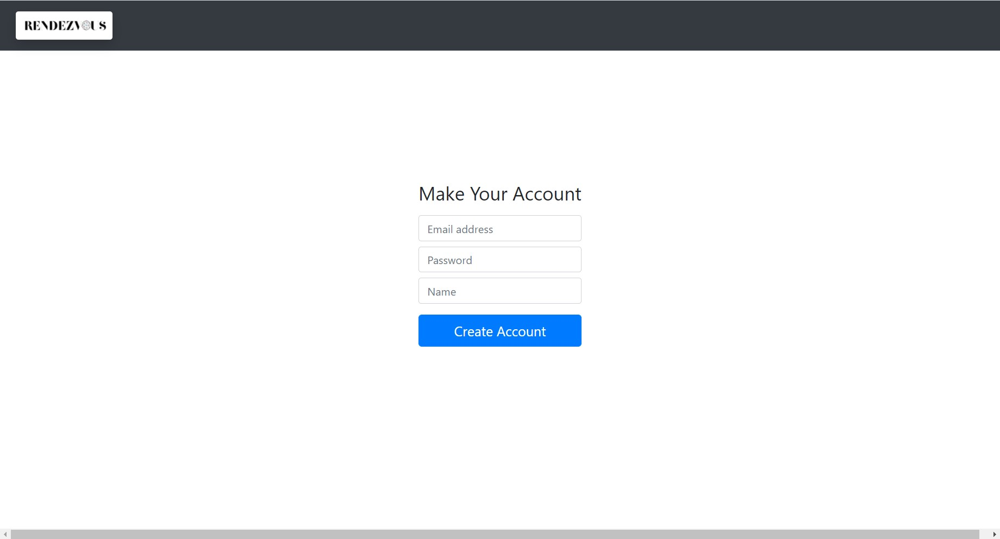
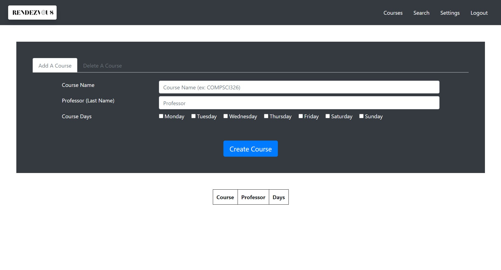
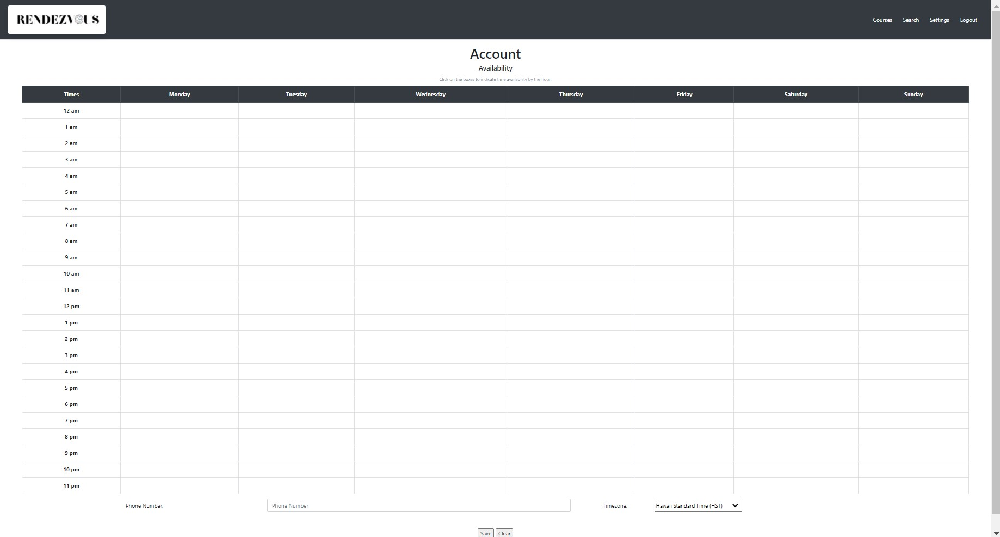
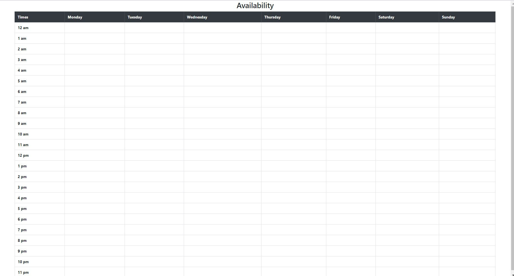

# Link to Heroku App

https://cs326-xi.herokuapp.com/login

# Title

Rendezvous

### Subtitle

Rendezvous

# Semester

Fall 2020

# Overview

The application provides a platform for users to enter data focused around university courses with additional data related to timezones and availability to attend study sessions. The user will be able to log in and enter the courses they are taking by providing a course name, professor, and the days the course takes place. The application displays the user's courses in a table for the user's convenience. Additionally, the user will be able to set and update their time availability throughout a week using a calendar-like table in the Settings page. A key aspect of this application is that it allows users to look at a pool of other users who are also using this platform and narrow down the amount of people by applying filters. The filters include the user's courses, professors, course days, and timezone. The application makes a user's email publicly available during the filtering process and a phone number is optional This enables users to find study partners or groups for their specified classes. Given the current state of online schooling, being able to find classmates and coordinate meeting times for study sessions or just exchange contact information can benefit the learning experience of the users of this platform. International students, or students who want to collaborate with students that live far away, will benefit greatly from filtering down to other users who are in the same timezone for convenience of real time communication. 

# Team Members

Olivia Brennan (oliviarb), JengYu Chou (jelchou), Janvi Tanniru (jtanniru)

# User Interface

Login Page

Register Page

Courses Page (user can add new courses, delete current courses, and view current courses)

Search Page (for filtering other users of the platform to find classmates to communicate with)

Settings Page (user can add a timezone and update their weekly availability)

Availability (displays a given user's weekly availability table)

# APIs

RESTful APIs

# Database

courseInfo Table

| Column       | Data Type | Description                             |
|--------------|-----------|-----------------------------------------|
| course_name  | String    | The name of the course                  |
| professor    | String    | The name of the professor               |
| course_days  | Boolean[] | The days the course takes place         |
| email        | String    | The email of the user taking the course |

userInfo Table

| Column       | Data Type  | Description                     |
|--------------|------------|---------------------------------|
| email        | String     | The email of user               |
| name         | String     | The name of the user            |
| salt         | String     | The salt of the user password   |
| hash         | String     | The hash of the user password   |
| phone        | String     | The phone number of the counter |
| timezone     | String     | The timezone of the user        |
| availability | Boolean[][]| The availability of the user    |

The courseInfo table contains rows such that each row is a single course for a user and contains the course's name, professor, days, and the user's email. The courseInfo table can be used to view all of the courses a user is taking, filter all users by one or more of the columns (for instance, it can be used to return all users that are taking a given course X). The userInfo table contains rows such that each row is a single user and contains the user's email, name, salt, hash (salt and hash for authentication), phone number, timezone, and availability. The userInfo table can be used to see if a user is already registered and for correct login information. 

# URL Routes/Mapping

| Route                | Description                                                                                              |
|----------------------|----------------------------------------------------------------------------------------------------------|
| /login               | performs authentication; if user not registered, redirects to login page, else takes user to course page |
| /logout              | logs out the signed in user, redirects to login page                                                     |
| /register            | add a new user and password IFF one doesn't exist in the userInfo table already                          |
| /course              | adds the logged in user's new course to the courseInfo table                                             |
| /course/view         | used to access user's saved courses to fill the courses table for the user to view                       |
| /course/:course_name | deletes specified course from the courseInfo table                                                       |
| /settings            | updates user's timezone and availability in the userInfo table                                           |
| /settings/view       | used to view the user's saved information in userInfo to render availability, timezone, and phone number |
| /search              | used to filter all users on the platform from the userInfo table                                         |
| /availability        | used to view the selected user's availability from the search page                                       |
| *                    | indicates error                                                                                          |

# Authentication/Authorization

Passport JS is used for authentication. A session is configured, along with a LocalStrategy object to validate a user and their password. A function findUser() takes the user's username and returns true if and only if the user exists. A function validatePassword() takes a user name and password and returns true if and only if the password is the one we have stored. Only logged in users can see pages that are not the login and register pages. 

# Division of Labor

### Olivia Brennan

- Initial layout of groups.html (deleted file)
- Review of all initial layout files
- HTML work: search.html settings.html,, availability.js
- JS work (front end): search.js, settings.js
- Server integration with settings.js and availability.js

### JengYu Chou

- Initial layout of homepage.html and courses.html
- HTML work: register.html, homepage.html, courses.html
- JS work (front end): register.js, homepage.js, courses.js
- Server integration with homepage.js, register.js, courses.js, search.js
- Aided availability.js front end

### Janvi Tanniru

- Initial layout of search.html and settings.html
- Logo design
- Brunt of the server functionalities: server.js, database.js
- Server integration with homepage.js, register.js, courses.js, search.js
- Aided availability.js server integration

# Conclusion

As a group, we came to the conclusion that it is harder to connect with people and classmates while doing online schooling. We thought that designing a website where users can find other peers that are taking the same courses would faciliate forming connections and creating study groups. After a brainstorming session we decided we needed a homepage for users to log in, a register page for new users, a page to display a user's current courses and allow for courses to be added and removed. We also thought that a page for communication would be useful to allow users to make contact directly on the platform. This proved to be too difficult to implement given time restrictions but would be an interesting feature to implementin the future. The most important part of the application is the search page that allows a user to filter through all the users on the platform by specific courses that users are enrolled in, as well as specific professors, course days, and timezones.

Throught working on the project we learned how to effectively divide up tasks based on each person's strengths as well as the difficulty of each task so that everyone had an balanced amount of work to do. Working on separate branches before attending group meetings helped with preventing too many merge conflicts and was useful for testing new implementations without ruining someone else's code or the code that was on the main branch. We found that using Git for this project facilitated teamwork and organization. The version control came in handy when we made small merging errors too. 

We found setting up the HTML, CSS, and front-end JavaScript relatively simple. We got used to using Bootstrap really quickly. Software, like Express JS, Passport JS, and pg-promise were a bit daunting a first because we had never heard of them before. But, with patience and group calls, we were able to understand how these should be used and that made implementation much easier. The most tiring parts were the group calls that lasted hours when we were trying to figure out how to implement the server integration. Long calls with the TA's introduced differents methods of debugging that we had not thought of before. Also, we found that sessions of pair programming were very useful for testing our code and resolving conflicts and errors. Learning how to use browser inspection tools (dev-tools) was particularly helpful for some minor HTML errors and back-end JavaScript errors. One particular hurdle that was difficult to overcome was figuring out the SQL queries for complicated tasks such as filtering by multiple columns. The only real drawback was that we dropped the page that would allow users to directly message each other on the application (groups.html). We decided to display a user's email and phone number (optional for the user to include) when users are filtered to faciliate an exchange of contact information and allow for communication even if it takes place separately from the application.

We would have liked to know more about SQL queries and how to use them in a program to fetch data and filter by multiple conditions. We would have also liked to know that predicted times for how long it would take to finish a task should be doubled since even the smallest bugs can take hours and set the whole team back. Sometimes we ran into situations where debugging just one or two errors took multiple calls with the TA's and multiple attempts to resolve. Working on the project in its entirety helped greatly with learning and understanding the concepts that we learned in lecture and in labs. 