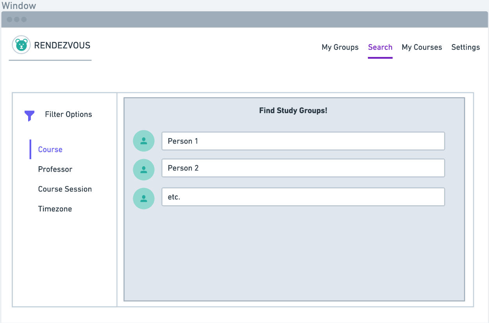

# Data Interactions

- The application provides a platform for users to enter data focused heavily around university courses with additional data related to timezones and availability to attend study sessions. 
- The data inputted by the user will be along the lines of university, course name/number, professor name for that course, and course session meeting dates and times for any given course the user is enrolled in.
- Additionally, the user will be able to set and update their time availability throughout a week. 
- A key aspect of this application is that it allows users to look at a pool of other users who are using this platform and narrow down the amount of people that a study group can be chosen from by applying filters. 
- The data taken in about a user's course(s) will be used to do this filtering. 
  - For instance, a user can narrow down the pool of other users by specifying that they only want to see other users that are taking the same course with the same professor as they are. 
  - And if this professor happens to teach more than one session for this course, the pool of users can be narrowed down even more if the user specifies which session of the course they are enrolled in. 
- Similary, users will be able to use timezones as a filter. 
  - This is useful when users only want to form groups with those who are in the same timezone for convenience. 
- Once the user has identified another user that they would like to get in touch with, they can establish a connection through creating a chat with this other user. 
- The application will use the time availabilities set by each user to compile a list of meeting dates/times where every group member has overlapping time availability.
  - If there is no one time that every group member's availabilities overlap, the application will return a list of dates/times for a meeting that a majority of the group are available to attend.

# Wireframes

# HTML and CSS

