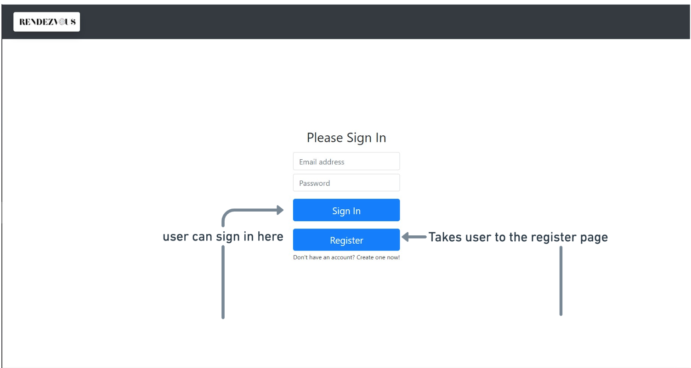
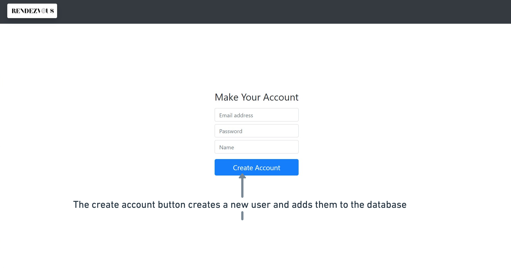
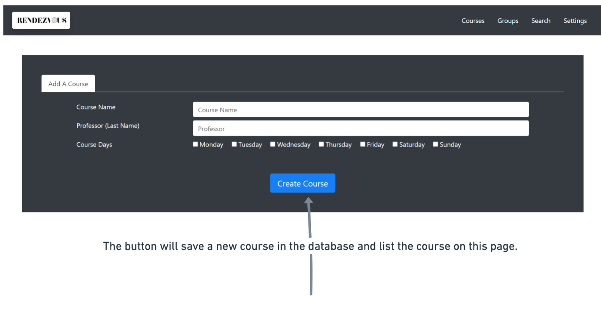
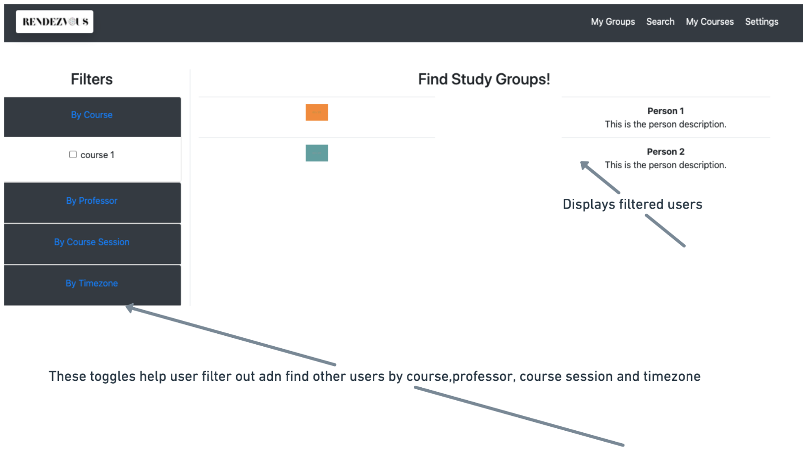
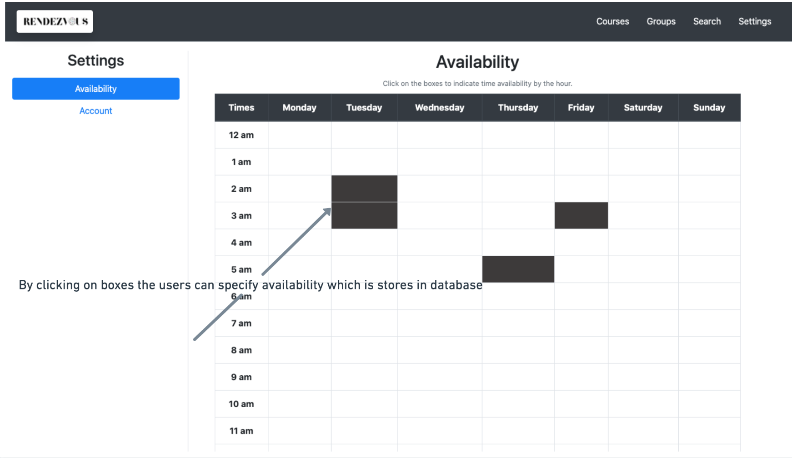
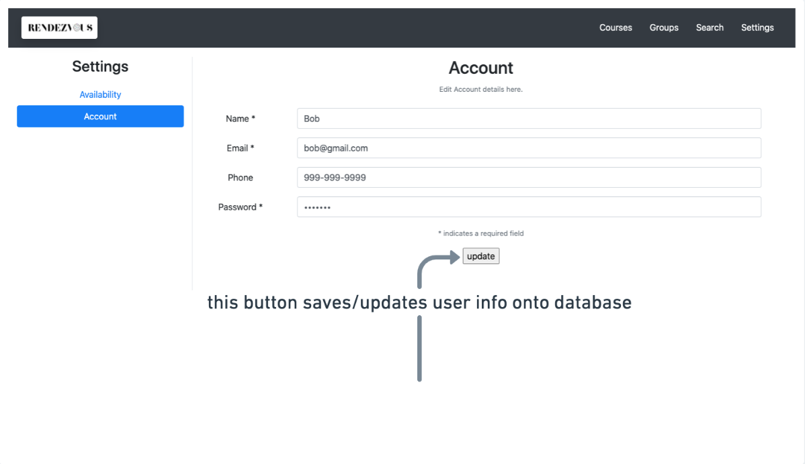

# Part 0: Project API Planning

API: 
* RESTful APIs

Data Flow:
- user object : firstName, lastName, id, email, phone, password, availability, timezone, courses
- course object: courseName, courseNumber, professor, sessionNumber, courseDays, courseTime, listOfUser 
- courses list:  course1, course2.

Endpoints:

/register which allows for a new user to sign up

/login which allows for a user to login
 
/course/new which allows for a course to be added to the list of course when a request is sent to this endpoint containing the courseName, courseNumber, professor, 
courseDays, courseTimes

/course/CID gets course info based on course id number 

/user/id/classes/new which relates a given course to users courses.

/user/id/courses/delete?cid= ''which deletes a given course(i.e. when the user drops the class or moves on to a new semester)

/user/id/courses/update?cid='temp course'&professor='temp prof'&(other info to be updated) which updates a given course(i.e. when the user changes class timings)

/user/id/search/new?cid='temp course'&courseTime='temp time'&(other filter) which outputs the list of people in the course specified by the current user filters

# Breakdown of Division of Labor
Janvi: server functionality (server.js)

Olivia: settings.html, search.html, settings,js, search.js (front end with js)

JengYu: register.html, homepage.html, courses.html, register.js, homepage.js, courses.js (front end with js)

link: https://cs326-xi.herokuapp.com